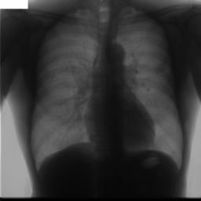
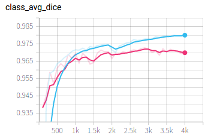
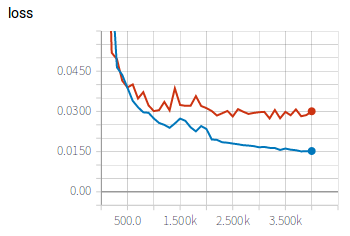

# Heart segmentation from JSRT dataset




In this example, we use U-Net to segment the heart from X-Ray images. First we download the images from internet, then edit the configuration file for training and testing. During training, we use tensorboard to observe the performance of the network at different iterations. We then apply the trained model to some testing images and obtain quantitative evaluation results.

## Data and preprocessing
1. The JSRT dataset is available at the [JSRT website][jsrt_link]. It consists of 247 chest radiographs. Create a new folder as `JSRT_root`, and download the images and save them in to a single folder, like `JSRT_root/All247images`. 
2. The annotation of this dataset is provided by the [SCR database][scr_link]. Download the annotations and move the unzipped folder `scratch` to `JSRT_root/scratch`.
3. Create two new folders  `JSRT_root/image` and `JSRT_root/label` for preprocessing.
4. Set `JSRT_root` according to your computer in `image_convert.py` and run `python image_convert.py` for preprocessing. This command converts the raw image format to png and resize all images into 256X256. The processed image and label are saved in `JSRT_root/image` and `JSRT_root/label` respectively.
5. Set `JSRT_root` according to your computer in `write_csv_files.py` and run `python write_csv_files.py` to randomly split images into training, validation and testing set. The output csv files are saved in `config`.

[jsrt_link]:http://db.jsrt.or.jp/eng.php
[scr_link]:https://www.isi.uu.nl/Research/Databases/SCR/ 

## Training
1. Edit `config/train_test.cfg` by setting the value of `root_dir` as your `JSRT_root`. Then add the path of `PyMIC` to `PYTHONPATH` environment variable and start to train by running:
 
```bash
export PYTHONPATH=$PYTHONPATH:your_path_of_PyMIC
python ../../pymic/train_infer/train_infer.py train config/train_test.cfg
```

2. During training or after training, run `tensorboard --logdir model/unet` and you will see a link in the output, such as `http://your-computer:6006`. Open the link in the browser and you can observe the average Dice score and loss during the training stage, such as shown in the following images, where red and blue curves are for training set and validation set respectively. We can observe some over-fitting on the training set. 




## Testing and evaluation
1. When training is finished. Run the following command to obtain segmentation results of testing images:

```bash
mkdir result
python ../../pymic/train_infer/train_infer.py test config/train_test.cfg
```

2. Then edit `config/evaluation.cfg` by setting `ground_truth_folder` as your `JSRT_root/label`, and run the following command to obtain quantitative evaluation results in terms of dice. 

```bash
python ../../pymic/util/evaluation.py config/evaluation.cfg
```

The obtained dice score by default setting should be close to 94.59+/-3.16. You can set `metric = assd` in `config/evaluation.cfg` and run the evaluation command again. You will get assd evaluation results. By default setting, the assd is close to 2.21+/-1.23 pixels.

