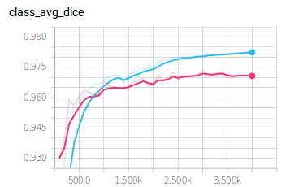
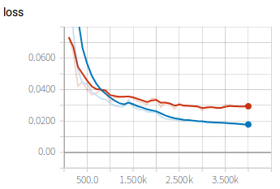

# Heart segmentation from 2D X-ray images using customized CNN


In this example, we show how to use a customized CNN and a customized loss function to segment the heart from X-Ray images. The configurations are the same as those in the `JSRT` example except the network structure and loss function. 

The customized CNN is detailed in `my_net2d.py`, which is a modification of the 2D UNet. In this new network, we use a residual connection in each block. The customized loss is detailed in `my_loss.py`, where we define a focal dice loss. 

We also write a customized main function in `jsrt_net_run.py` so that we can combine NetRunAgent from PyMIC with our customized CNN and loss function.

## Data and preprocessing
1. Data preprocessing is the same as that in the the `JSRT` example. Please follow that example for details.

## Training
1. Edit `config/train_test.cfg` by setting the value of `root_dir` as your `JSRT_root`, and start to train by running:
 
```bash
python jsrt_net_run.py train config/train_test.cfg
```

2. During training or after training, run `tensorboard --logdir model/my_net2d` and you will see a link in the output, such as `http://your-computer:6006`. Open the link in the browser and you can observe the average Dice score and loss during the training stage, such as shown in the following images, where blue and red curves are for training set and validation set respectively. 




## Testing and evaluation
1. Edit the `testing` section in `config/train_test.cfg`, and run the following command for testing:
 
```bash
python jsrt_net_run.py test config/train_test.cfg
```

2. Edit `config/evaluation.cfg` by setting `ground_truth_folder_root` as your `JSRT_root`, and run the following command to obtain quantitative evaluation results in terms of dice.

```
pymic_evaluate config/evaluation.cfg
```

The obtained dice score by default setting should be close to 94.61+/-2.84%. 
