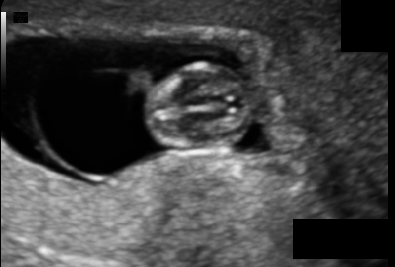
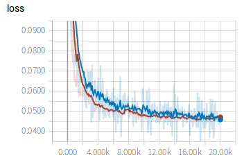

# Fetal brain segmentation from ultrasound images

 

In this example, we use 2D U-Net to segment the fetal brain from ultrasound images. First we download the images from internet, then edit the configuration file for training and testing. During training, we use tensorboard to observe the performance of the network at different iterations. We then apply the trained model to testing images and obtain quantitative evaluation results.

If you don't want to train the model by yourself, you can download a pre-trained model [here][model_link] and jump to the `Testing and evaluation` section.

## Data and preprocessing
1. We use the `HC18` dataset for this example. The images are available from the [website][hc18_link]. Download the HC18 training set that consists of 999 2D ultrasound images and their annotations. Create a new folder as `HC_root`, and download the images and save them in a sub-folder, like `HC_root/training_set`. 
2. The annotation of this dataset are contours. We need to convert them into binary masks for segmentation. Therefore, create a folder `HC_root/training_set_label` for preprocessing.
4. Set `HC_root` according to your computer in `get_ground_truth.py` and run `python get_ground_truth.py` for preprocessing. This command converts the contours into binary masks for brain, and the masks are saved in `HC_root/training_set_label`.
5. Set `HC_root` according to your computer in `write_csv_files.py` and run `python write_csv_files.py` to randomly split the official HC18 training set into our own training (780 images), validation (70 images) and testing (149 images) sets. The output csv files are saved in `config`.

[model_link]:https://drive.google.com/open?id=1pYwt0lRiV_QrCJe5ef9IsLf4NKyrFRRD
[hc18_link]:https://hc18.grand-challenge.org/

## Training
1. Edit `config/train_test.cfg` by setting the value of `root_dir` as your `HC_root`. Then add the path of `PyMIC` to `PYTHONPATH` environment variable (if you haven't done this) and start to train by running:
 
```bash
export PYTHONPATH=$PYTHONPATH:your_path_of_PyMIC
python ../../pymic/train_infer/train_infer.py train config/train_test.cfg
```

2. During training or after training, run `tensorboard --logdir model/unet` and you will see a link in the output, such as `http://your-computer:6006`. Open the link in the browser and you can observe the average Dice score and loss during the training stage, such as shown in the following images, where red and blue curves are for training set and validation set respectively. 




## Testing and evaluation
1. Run the following command to obtain segmentation results of testing images. If you use [the pretrained model][model_link], you need to edit `checkpoint_name` in `config/train_test.cfg`.

```bash
mkdir result
python ../../pymic/train_infer/train_infer.py test config/train_test.cfg
```

2. Then edit `config/evaluation.cfg` by setting `ground_truth_folder_list` as your `HC_root/training_set_label`, and run the following command to obtain quantitative evaluation results in terms of dice. 

```bash
python ../../pymic/util/evaluation.py config/evaluation.cfg
```

The obtained dice score by default setting should be close to 97.05+/-3.63%. You can set `metric = assd` in `config/evaluation.cfg` and run the evaluation command again. You will get average symmetric surface distance (assd) evaluation results. By default setting, the assd is close to 7.83+/-11.88 pixels. We find that the assd values are high for the segmentation results. You can try your efforts to improve the performance with different networks or training strategies by changing the configuration file `config/train_test.cfg`.

