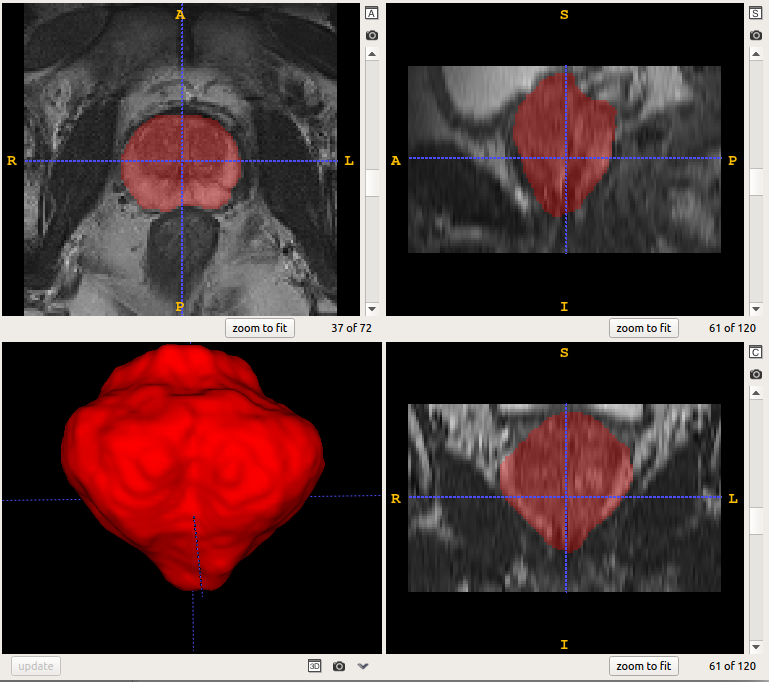
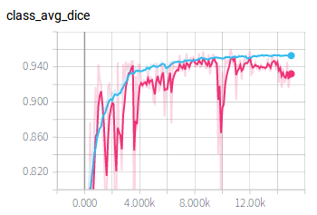
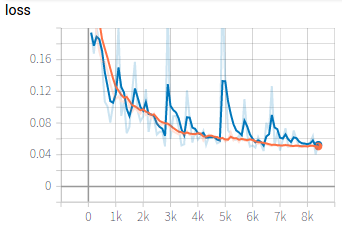

# Prostate segmentation from 3D MRI
 

In this example, we use 3D U-Net to segment the prostate from 3D MRI. First we download the images from internet, then edit the configuration file for training and testing. During training, we use tensorboard to observe the performance of the network at different iterations. We then apply the trained model to testing images and obtain quantitative evaluation results. 

If you don't want to train the model by yourself, you can download a pre-trained model [here][model_link] and jump to the `Testing and evaluation` section.

## Data and preprocessing
1. We use the `Promise12` dataset for this example. The images are available from the [website][promise12_link]. Download the training set that consists of 50 3D MR images and their annotations. The whole dataset consists of three parts. Create a new folder such as `data/promise12`, and download the images and save them in a sub-folder, like `data/promise12/TrainingData_Part1`, `data/promise12/TrainingData_Part2`, and `data/promise12/TrainingData_Part3`. 
2. Before we use these data, some preprocessing steps are needed, such as resampling them into a uniform resolution and crop the images to a smaller size. Create two folders `data/promise12/preprocess/image` and `data/promise12/preprocess/label`, then set the value of `data_dir` in `preprocess.py`  according to your system. Run `python preprocess.py` for preprocessing.
3. Open `write_csv_files.py` and set `data_dir` accordingly, such as `data/promise12/preprocess`. Run `python write_csv_files.py` to randomly split the dataset into our own training (35 images), validation (5 images) and testing (10 images) sets. The output csv files are saved in `config/data`.

[model_link]:https://drive.google.com/open?id=1pYwt0lRiV_QrCJe5ef9IsLf4NKyrFRRD
[promise12_link]:https://promise12.grand-challenge.org/

## Training
1. Edit `config/train_test.cfg` by setting the value of `root_dir` as your `data/promise12/preprocess`. Then start to train by running:
 
```bash
pymic_net_run train config/train_test.cfg
```

2. During training or after training, run `tensorboard --logdir model` and you will see a link in the output, such as `http://your-computer:6006`. Open the link in the browser and you can observe the average Dice score and loss during the training stage, such as shown in the following images, where blue and red curves are for training set and validation set respectively. 




## Testing and evaluation
1. Run the following command to obtain segmentation results of testing images. If you use [the pretrained model][model_link], you need to edit `checkpoint_name` in `config/train_test.cfg`.

```bash
mkdir result
pymic_net_run test config/train_test.cfg
```

2. Then edit `config/evaluation.cfg` by setting `ground_truth_folder_root` as your `data/promise12/preprocess`, and run the following command to obtain quantitative evaluation results in terms of dice. 

```bash
pymic_evaluate config/evaluation.cfg
```

The obtained dice score by default setting should be close to 87.28+/-2.58%. You can set `metric = assd` in `config/evaluation.cfg` and run the evaluation command again. You will get average symmetric surface distance (assd) evaluation results. By default setting, the assd is close to 2.61+/-1.87 pixels. You can try your efforts to improve the performance with different networks or training strategies by changing the configuration file `config/train_test.cfg`.

